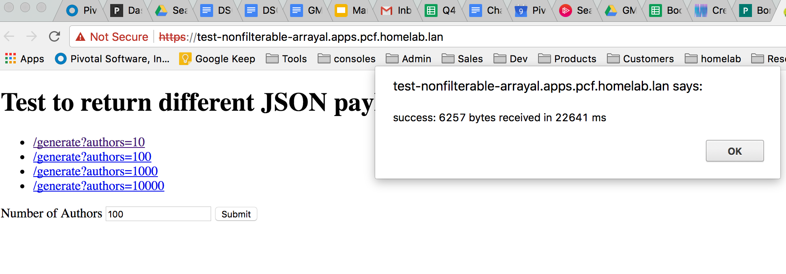

# json-transfer-simulator

simple test to return different sizes of json  payload by specifying number of authors objects.

## Build and deploy on Cloud Foundry

```
$> ./mvnw package
```

Then modify the **manifest.yml** for your environment and

```
$> cf push
```

You can hit the application and see the endpoints or use the form to submit requests with different result payloads.

**Note:** The endpoint expects an integer (max value: 2,147,483,647), so don't go above the acceptable values. And go slow, because the application builds the buffer in-memory.

## Application Screenshot


